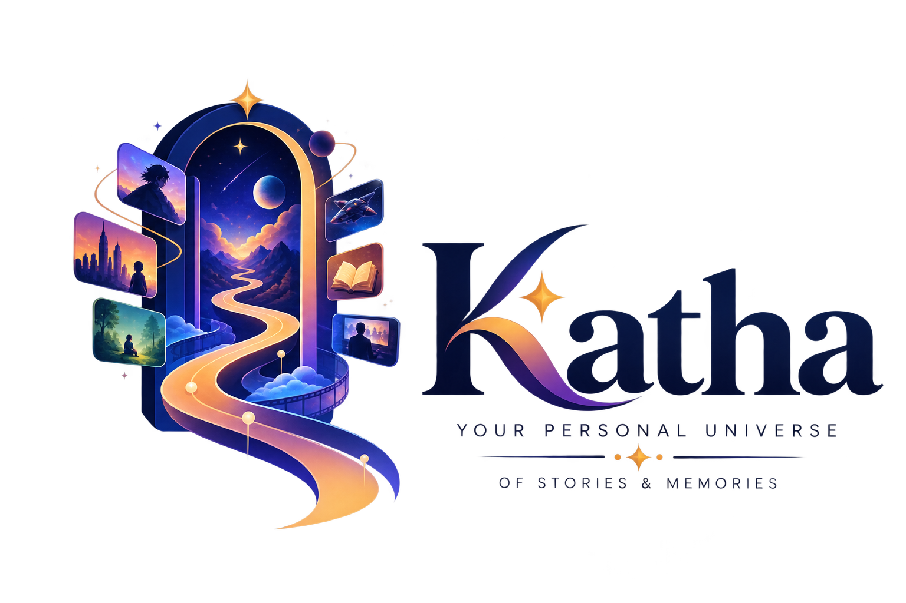

<div align="center">



# 🌌 Katha

*Your personal memory engine for the stories that shape your life.*

[](https://katha.vercel.app)
[]()
[]()
[]()
[]()
[]()

---

**[🚀 Launch Live Application](https://katha.vercel.app)**  
*(Offline-first PWA: Loads instantly even without internet)*

</div>

<br/>

## ✨ What is Katha?

> Katha isn't just another entertainment tracker like Letterboxd or MyAnimeList. It is a **personal memory engine** that transforms your entertainment journey into wisdom, insights, and legacy. 

Every movie, series, anime, documentary, and book you experience becomes a permanent chapter of your life story. We believe that the stories you consume shape who you become. Katha helps you track not just *what* you watched, but *how it made you feel* and *what you learned* from it.

<br/>

<details>
<summary><b>🧠 The Katha Experience (Click to Expand)</b></summary>
<br/>

### Smriti Intelligence Engine
At the core of Katha is **Smriti** — an advanced intelligence engine powered by Google Gemini that analyzes your consumption patterns.
* 🎭 **Emotional Tracking:** Map how specific genres or media affect your mood over time.
* ⚡ **Impact Index:** A proprietary scoring system (1-100) that calculates how deeply a story resonated with your life.
* 💡 **Wisdom Extraction:** Save profound quotes, life lessons, and epiphanies directly tied to specific moments in a story.

### 📚 The Universal Library
A unified digital bookshelf for all your media.
* 🎬 **Cross-Media Tracking:** Movies (TMDB/OMDB), Anime (Jikan/MyAnimeList), TV Shows (Watchmode), and Books all live in one seamless interface.
* 🗂️ **Smart Shelving:** Automatically organizes your collection by life phase, emotional impact, and custom tags.

### 🧭 The Smriti Atlas (Discover)
A curated discovery engine designed to kill decision fatigue.
* 🌡️ **Mood-Based Routing:** Tell the Atlas how you feel (e.g., "Melancholic", "Need Inspiration", "Brain Dead"), and it finds the perfect story.
* ⏳ **Life Phase Recommendations:** Curated picks for when you're graduating, going through a breakup, or starting a new career.

### 🔮 Memory World
A visual representation of your media life.
* ⏱️ **The Timeline:** A chronological, scrollable journey of your media consumption history.
* 🖼️ **The Gallery:** A stunning visual mosaic of everything you've watched.
* 📖 **Life Journal:** A dedicated space for the wisdom and quotes you've extracted.

</details>

<details>
<summary><b>🎨 Midnight Library Design System</b></summary>
<br/>

Katha features a custom, ultra-premium design system built on top of Tailwind CSS and Framer Motion, inspired by the intersection of Apple's polished UI and Netflix's immersive cinematic experience.

- 🌌 **Canvas:** Deep midnight black (`#04050C` / `#0B0C14`).
- 🪞 **Surfaces:** Translucent glassmorphism with dynamic ambient glows and deep drop shadows.
- 🎬 **Motion Primitives:** Hardware-accelerated cinematic animations including *Magnetic* buttons, *Tilt* physics on story cards, *GlowEffects*, and a custom *Cinematic Cursor*.
- 🌈 **Neon Accents:** 🟣 Violet (Wisdom), 🔵 Cyan (Memory), 🔴 Rose (Emotion), 🟢 Emerald (Growth).

</details>

<details>
<summary><b>🔒 Security & Privacy Architecture</b></summary>
<br/>

We believe your personal stories and emotional data are intimately yours. Katha is built with strict privacy and security standards.

* 🛡️ **Zero Cloud Storage:** Your media data never leaves your device. Everything is stored locally in your browser using IndexedDB.
* 🔐 **Secure Edge APIs:** All external integrations (TMDB, Gemini) are routed through Vercel Edge Functions with strict `Zod` payload validation and active rate limiting to prevent abuse and prompt injection.
* 📦 **Data Portability:** Complete data portability. Export everything instantly to JSON, PDF, or Word documents. You own your memories.

</details>

<br/>

## 🏗️ Architecture & Tech Stack

| Domain | Technology | Purpose |
| :--- | :--- | :--- |
| **Core Framework** | React 18, TypeScript, Vite | Fast rendering, strict typing, rapid HMR. |
| **Styling** | Tailwind CSS | Utility-first styling for complex glassmorphic UI. |
| **Motion/Animation** | Framer Motion | High-performance spring physics and layout animations. |
| **State Management** | Zustand | Lightweight, un-opinionated global state. |
| **Local Database** | Dexie.js (IndexedDB) | Robust, typed wrapper for local browser storage. |
| **AI Integration** | Google Gemini API | Powers the Smriti intelligence and reasoning engines. |
| **Hosting & Deploy** | Vercel & Edge Functions | High-speed global CDN, secure API routing, and SSR proxying. |

<br/>

## 🚀 Quick Start (Local Development)

Ready to build your personal atlas? Follow these steps to run Katha locally.

1. **Clone the repository**
   ```bash
   git clone https://github.com/AdityaPatil2549/Katha.git
   cd Katha
   ```

2. **Install dependencies**
   ```bash
   npm install
   ```

3. **Set up Environment Variables**
   Katha connects to various external APIs and AI services.
   ```bash
   cp .env.example .env.local
   ```
   Open `.env.local` and add your API keys:
   - `GEMINI_API_KEY`: Required for Smriti Intelligence and Discovery features.
   - `TMDB_API_KEY`: For Movies and TV Shows metadata.
   - `OMDB_API_KEY`: For backup movie data.

4. **Start the development server**
   ```bash
   npm run dev
   ```
   *Visit `http://localhost:5173` to enter the Katha universe.*

<br/>

## 📱 Installing as an App (PWA)

Katha is designed to feel like a native application. You can install it on your devices directly from the Live URL:

* 🍎 **iOS / iPadOS:** Open Katha in Safari, tap the "Share" icon, and select "Add to Home Screen".
* 🤖 **Android:** Open Katha in Chrome, tap the three-dot menu, and select "Install app" or "Add to Home screen".
* 💻 **Desktop (Chrome/Edge):** Look for the install icon (monitor with a downward arrow) in the right side of your URL bar.

<br/>

## 🤝 Contributing

We welcome contributions! If you're passionate about storytelling, personal knowledge management, or just really beautiful UI, feel free to jump in.

<details>
<summary><b>View Contribution Guidelines</b></summary>
<br/>

1. Fork the Project
2. Create your Feature Branch (`git checkout -b feature/AmazingFeature`)
3. Commit your Changes (`git commit -m 'feat: Add some AmazingFeature'`)
4. Push to the Branch (`git push origin feature/AmazingFeature`)
5. Open a Pull Request

</details>

<br/>

---
<div align="center">
  <sub>Built with passion for stories that matter.</sub>
</div>
