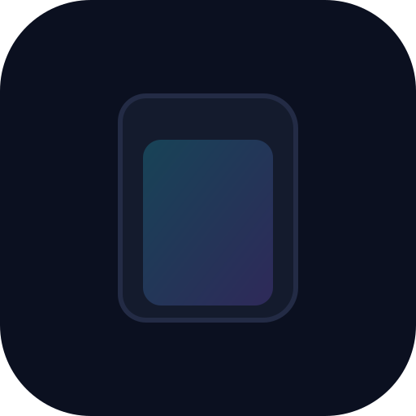

<div align="center">



# 🌌 Katha

**Your Personal Universe of Stories & Memories**

<p align="center">
  <a href="https://katha-9eda9.web.app"></a>
  
  
  
  
</p>

*Powered by the **Smriti Intelligence Engine***

---

</div>

## 🚀 Live Application

Experience Katha right now, fully deployed and optimized:
👉 **[Launch Katha on Firebase](https://katha-9eda9.web.app)**

*Note: Katha is an offline-first PWA. Once you visit the site, it caches the core assets, meaning it will load instantly even if you lose your internet connection.*

<br/>

## ✨ What is Katha?

Katha isn't just another entertainment tracker (like Letterboxd or MyAnimeList). It is a **personal memory engine** that transforms your entertainment journey into wisdom, insights, and legacy. Every movie, series, anime, documentary, and book you experience becomes a permanent chapter of your life story.

We believe that the stories you consume shape who you become. Katha helps you track not just *what* you watched, but *how it made you feel* and *what you learned* from it.

<br/>

## 🌟 The Katha Experience & Core Features

### 🧠 Smriti Intelligence Engine
At the core of Katha is **Smriti** — a local intelligence engine that analyzes your consumption patterns.
* 🎭 **Emotional Tracking:** Map how specific genres or media affect your mood over time.
* ⚡ **Impact Index:** A proprietary scoring system (1-100) that calculates how deeply a story resonated with your life.
* 💡 **Wisdom Extraction:** Save profound quotes, life lessons, and epiphanies directly tied to specific moments in a story.

### 📚 The Universal Library
A unified digital bookshelf for all your media.
* 🎬 **Cross-Media Tracking:** Movies (TMDB/OMDB), Anime (Jikan/MyAnimeList), TV Shows (Watchmode), and Books all live in one seamless interface.
* 🗂️ **Smart Shelving:** Automatically organizes your collection by life phase, emotional impact, and custom tags.

### 🧭 The Smriti Atlas (Discover)
A curated discovery engine designed to kill decision fatigue.
* 🌡️ **Mood-Based Routing:** Tell the Atlas how you feel (e.g., "Melancholic", "Need Inspiration", "Brain Dead"), and it finds the perfect story.
* ⏳ **Life Phase Recommendations:** Curated picks for when you're graduating, going through a breakup, or starting a new career.

### 🔮 Memory World
A visual representation of your media life.
* ⏱️ **The Timeline:** A chronological, scrollable journey of your media consumption history.
* 🖼️ **The Gallery:** A stunning visual mosaic of everything you've watched.
* 📖 **Life Journal:** A dedicated space for the wisdom and quotes you've extracted.

<br/>

## 🎨 The Midnight Library Design System

Katha features a custom, ultra-premium design system built on top of Tailwind CSS and Framer Motion, inspired by the intersection of Apple's polished UI and Netflix's immersive cinematic experience.

* **Canvas:** Deep midnight black (`#04050C` / `#0B0C14`).
* **Surfaces:** Translucent glassmorphism with dynamic ambient glows and deep drop shadows.
* **Neon Accents:** 
  * 🟣 **Violet** (Wisdom & Intelligence)
  * 🔵 **Cyan** (Memory & Discovery)
  * 🔴 **Rose** (Emotion & Heart)
  * 🟢 **Emerald** (Growth & Action)
* **Motion:** Magnetic cursors, staggered blur reveals, fluid spring animations, and text-reveal effects. No harsh cuts; everything flows.

<br/>

## 🔒 100% Privacy. Zero Cloud.

We believe your personal stories and emotional data are intimately yours. Katha is built as a **Local-First PWA (Progressive Web App)**.

* 🛡️ **No Servers:** Your data never leaves your device. Everything is stored locally in your browser using IndexedDB.
* ✈️ **Offline First:** Works flawlessly on an airplane or in a cabin in the woods. Once loaded, you don't need the internet to browse your library.
* 📦 **Your Data:** Complete data portability. Export everything instantly to JSON, PDF, or Word documents. You own your memories.

<br/>

## 🏗️ Architecture & Tech Stack

Katha uses a modern, lightning-fast frontend stack.

| Domain | Technology | Purpose |
|:---:|:---|:---|
| **Core Framework** | React 18, TypeScript, Vite | Fast rendering, strict typing, rapid HMR. |
| **Styling** | Tailwind CSS | Utility-first styling for complex glassmorphic UI. |
| **Motion/Animation** | Framer Motion | High-performance spring physics and layout animations. |
| **State Management**| Zustand | Lightweight, un-opinionated global state. |
| **Local Database** | Dexie.js (IndexedDB) | Robust, typed wrapper for local browser storage. |
| **Data Fetching** | Custom API Services | Integrations with TMDB, OMDB, Jikan, Trakt, and Watchmode. |
| **Hosting & Deploy**| Firebase Hosting | High-speed global CDN with HTTP/2 and asset compression. |

<br/>

## 🚀 Quick Start (Local Development)

Ready to build your personal atlas? Follow these steps to run Katha locally.

### Prerequisites
* Node.js (v18 or higher)
* npm or yarn

### 1. Clone the repository
```bash
git clone https://github.com/AdityaPatil2549/Katha.git
cd Katha
```

### 2. Install dependencies
```bash
npm install
```

### 3. Set up Environment Variables
Katha connects to various external APIs to fetch movie, TV, and anime metadata. 

Copy the example environment file:
```bash
cp .env.example .env.local
```
Open `.env.local` and add your API keys. *Note: You can run the app without some of these, but specific discovery features may be limited.*
* `VITE_TMDB_API_KEY`: For Movies and TV Shows.
* `VITE_OMDB_API_KEY`: For backup movie data.

### 4. Start the development server
```bash
npm run dev
```

Visit `http://localhost:5173` to enter the Katha universe.

<br/>

## 📱 Installing as an App (PWA)

Katha is designed to feel like a native application. You can install it on your devices directly from the [Live URL](https://katha-9eda9.web.app):

* **iOS / iPadOS:** Open Katha in Safari, tap the "Share" icon, and select "Add to Home Screen".
* **Android:** Open Katha in Chrome, tap the three-dot menu, and select "Install app" or "Add to Home screen".
* **Desktop (Chrome/Edge):** Look for the install icon (monitor with a downward arrow) in the right side of your URL bar.

<br/>

## 🤝 Contributing

We welcome contributions! If you're passionate about storytelling, personal knowledge management, or just really beautiful UI, feel free to jump in.

1. Fork the Project
2. Create your Feature Branch (`git checkout -b feature/AmazingFeature`)
3. Commit your Changes (`git commit -m 'feat: Add some AmazingFeature'`)
4. Push to the Branch (`git push origin feature/AmazingFeature`)
5. Open a Pull Request

<br/>

---
<div align="center">
  
**Katha** — *Your story, remembered forever.* <br/>
Built with 💜 by [Aditya Yuvraj Patil](https://github.com/AdityaPatil2549)

</div>
